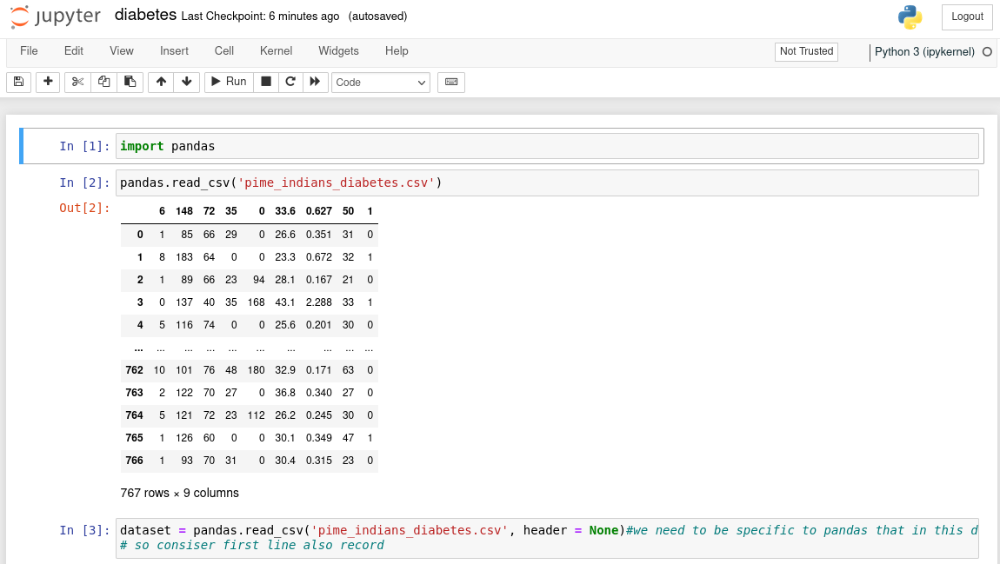

# Diabetes-Predictor

It is a Deep Learning model which is trained to pridict wether the user has diabetes or not based on the certian input given by the user: 

- Number of time pregnant
- Diastolic Blood Pressure
- Tricep skin fold thickness
- 2-Hour Serum insulin
- Body mass index
- Diabetes pedigree function
- Age

## How to contribute?

- Fork the repository
- Create new Branch
- Add Feature
- Create Pull Request

